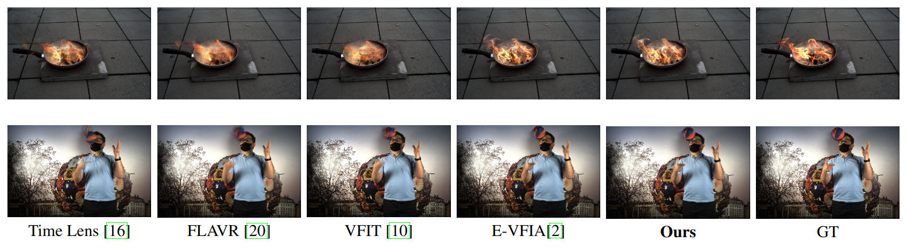

# MAEVI: Motion Aware Event-Based Video Frame Interpolation  
by  
Ahmet Akman [[GitHub](https://github.com/ahmetakman), [LinkedIn](https://linkedin.com/in/ahmet-akman-039b05148)],

Onur Selim Kılıç [[GitHub](https://github.com/OnurSelim), [LinkedIn](https://www.linkedin.com/in/onur-selim-kili%C3%A7-6486371a7/)],  
  
A. Aydın Alatan [[Website](https://users.metu.edu.tr/home105/alatan/wwwhome/), [LinkedIn](https://linkedin.com/in/a-aydin-alatan-864820)] 
  
  
 [[Paper](https://arxiv.org/abs/2303.02025)]  
  
This paper is accepted for publication in [ICIP23](https://2023.ieeeicip.org/).

  
  
*Qualitative comparisons against the state-of-the-art video interpolation algorithms.*  
  
  
## Abstract  
  
Utilization of event-based cameras is expected to improve the visual quality of video frame interpolation solutions. We introduce a learning-based method to exploit moving region boundaries in a video sequence to increase the overall interpolation quality.Event cameras allow us to determine moving areas precisely; and hence, better video frame interpolation quality can be achieved by emphasizing these regions using an appropriate loss function. The results show a notable average PSNR improvement of 1.3 dB for the tested data sets, as well as subjectively more pleasing visual results with less ghosting and blurry artifacts. 
## Environment Setup

We strongly recommend using Anaconda. Open a terminal in ./python folder, and simply run the following lines to create the environment:

````
conda env create -f environment.yml
conda activate MAEVI
````
## Train

* Download the [BS-ERGB](https://github.com/uzh-rpg/timelens-pp) dataset.
* Move the dataset-txt files into dataset folder. 
* Then train MAEVI using preffered (you can edit config.py) training configurations

```
python main.py --data_root <dataset_path>
```


## Test
After training, you can evaluate the model with following command:
* Or you can edit the config.py for your own preferences.
```
python test.py --data_root <dataset_path> --load_from pretrained/model_best.pth
```
You can also evaluate MAEVI via our pretrained weights [here](https://drive.google.com/file/d/1AfWtvbKxV1_tj7ooZj7iZmJi1Mm5KIVr/view?usp=sharing).

## BibTeX Citation

Please consider citing this paper if you find the code useful in your research:
```
@article{akman2023maevi,
  title={MAEVI: Motion Aware Event-Based Video Frame Interpolation},
  author={Akman, Ahmet and K{\i}l{\i}{\c{c}}, Onur Selim and Alatan, A Ayd{\i}n},
  journal={arXiv preprint arXiv:2303.02025},
  year={2023}
}


```

## References
Great video frame interpolation resources that we made use of:
* Event-Based Video Frame Interpolation with Attention, ICRA 2023 [Code](https://github.com/ahmetakman/E-VFIA)
* VFIT: Video Frame Interpolation Transformer, CVPR 2022 [Code](https://github.com/zhshi0816/Video-Frame-Interpolation-Transformer)
* TimeLens: Event-based Video Frame Interpolation, CVPR 2021 [Code](https://github.com/uzh-rpg/rpg_timelens )
* FLAVR: Flow-Agnostic Video Representations for Fast Frame Interpolation, arXiv 2021 [Code](https://github.com/tarun005/FLAVR)
* QVI: Quadratic Video Interpolation, NeurIPS 2019 [Code](https://github.com/xuxy09/QVI)
* AdaCoF: Adaptive Collaboration of Flows for Video Frame Interpolation, CVPR 2020 [Code](https://github.com/HyeongminLEE/AdaCoF-pytorch)
